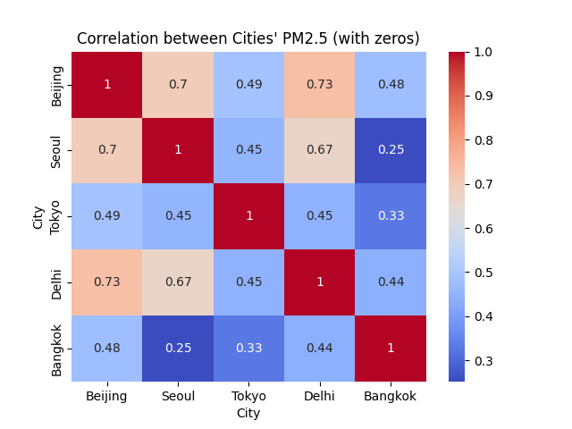
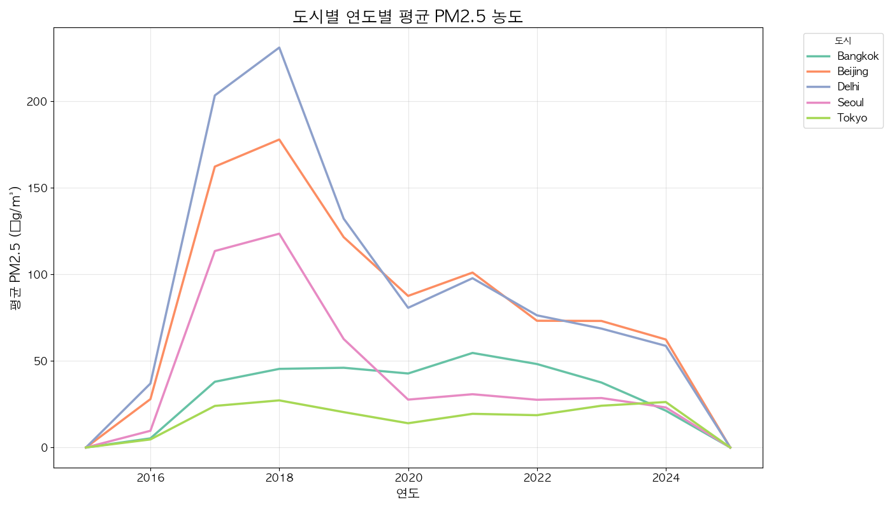

# 팀명 : 똥강아지들의 미세먼지 분석기

# 🫡팀원 소개
<div align="center">

| 이현대 | 신진슬 | 전유빈 | 나지윤 |
|--------|--------|--------|-------|
|  |  |  |  |

</div>


# 📅 개발기간
2025.03.17 ~ 2025.03.20 (4일)

# 주제 : 중국발 미세먼지가 주변국에 미치는 영향 분석

##  주제 선정 이유

<figure  style="text-align: center;">

<figcaption>데이터 프레임 정보</figcaption>
</figure>

🔗 관련 기사:
- [중국발 미세먼지 및 몽골발 황사 영향](https://www.chosun.com/national/transport-environment/2025/03/12/NISU7VVNRRGXZFIE27QK4C6MK4/)
- [여기 넣은 기사 하나가 필요하다.](https://www.sukbakmagazine.com/news/articleView.html?idxno=61073)


| 등급       | PM10 (μg/m³) | PM2.5 (μg/m³) |
|------------|--------------|---------------|
| 좋음       | 0~30         | 0~15          |
| 보통       | 31~80        | 16~35         |
| 나쁨       | 81~150       | 36~75         |
| 매우 나쁨  | 151 이상     | 76 이상       |

---

## 📂 분석에 사용한 데이터셋

Google Earth Engine

**데이터 내용:** 
도시별 미세먼지 및 초 미세먼지 농도
## 기술 스택
### 데이터 시각화

 ||| |


## 🔍 DataSet을 통해 얻고자 하는 인사이트

1. **중국의 미세먼지 농도에 따른 주변국의 미세먼지 예측**

# 데이터셋 데이터 구조
| 열 번호 | 열 이름          | 설명   | 데이터 타입 |
|---------|------------------|---------------|-------------|
| 0       | Date            | 날짜        | object      |
| 1       | City            | 도시        | object      |
| 2       | Longitude       | 경도        | float64     |
| 3       | Latitude        | 위도        | float64     |
| 4       | PM2.5 (µg/m³)   | 초미세먼지 농도        | float64     |
| 5       | PM10 (µg/m³)    | 미세먼지 농도        | float64     |


# EDA 절차

##  **데이터 로드** 
```
df = pd.read_csv('./data/pm25_pm10_merged.csv')
```
# 데이터 시각화
- 도시별 미세먼지 상관관계 히트맵

- 연도별 도시의 평균 초미세먼지 농도

# 데이터 학습 
- DBScan, Gradient Boosting, Kmeans, Line, XG

# 학습 점수

# 예측

