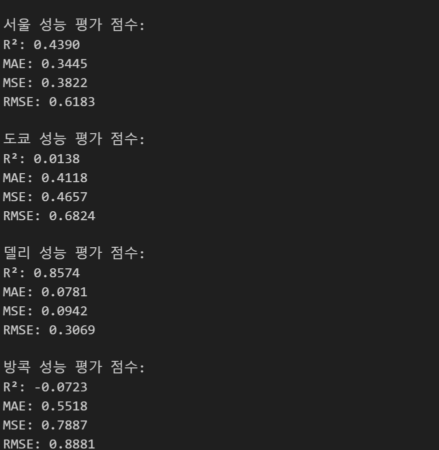
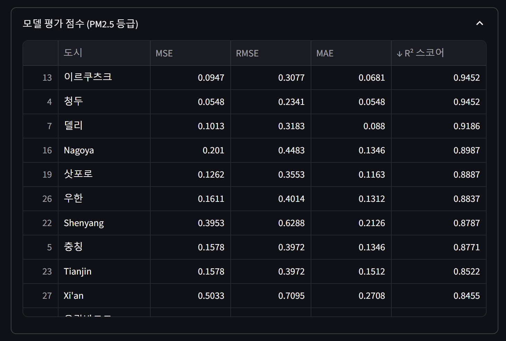
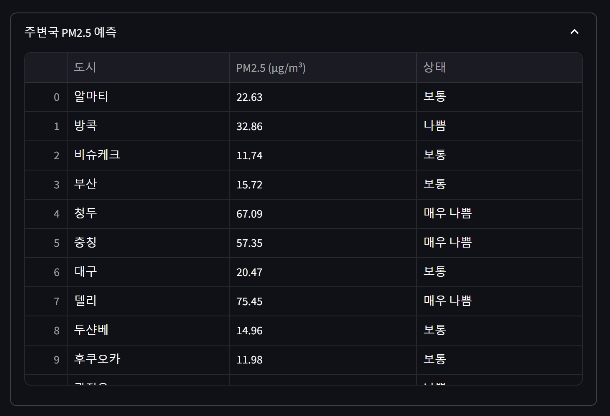
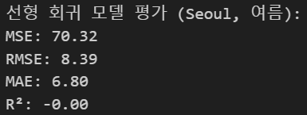
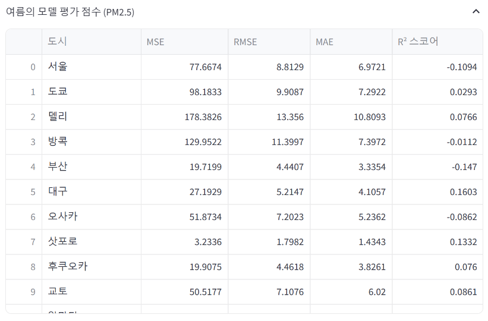
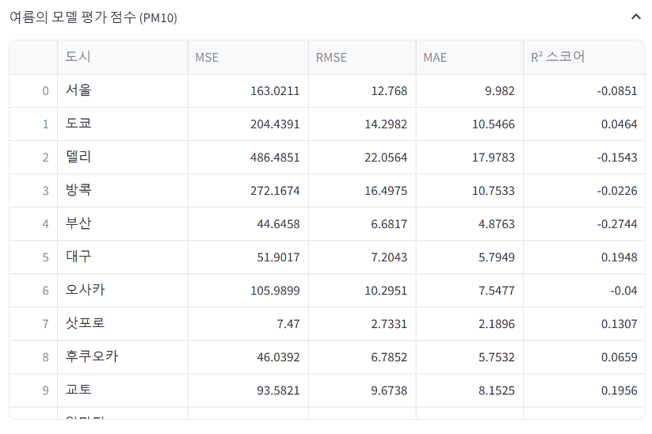
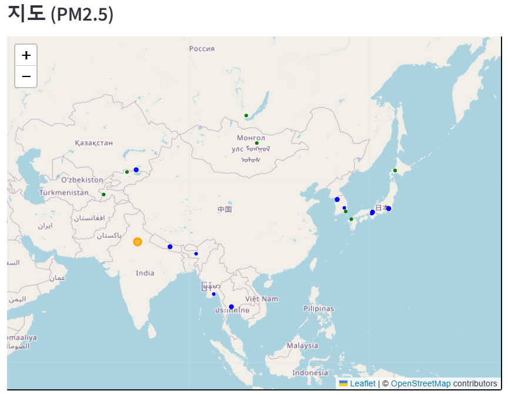
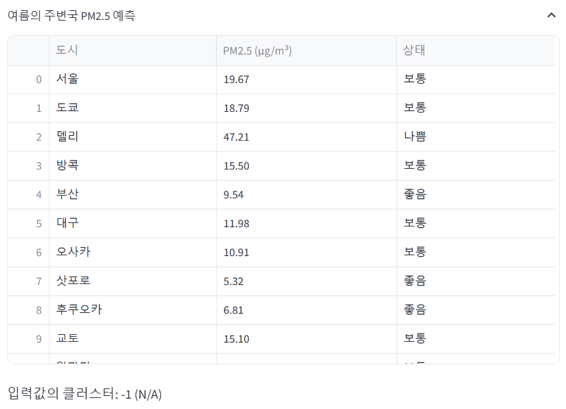
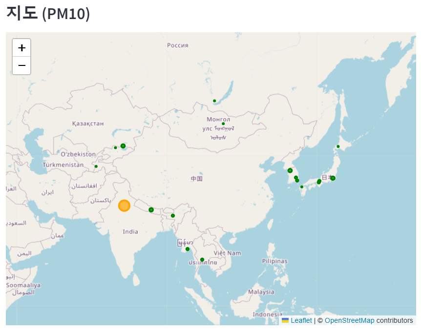
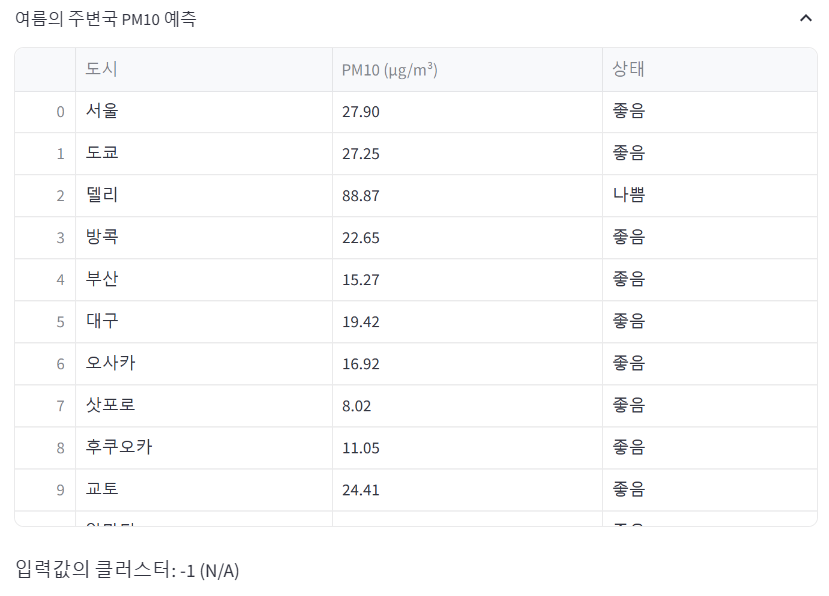

# 팀명 : 똥강아지들의 미세먼지 분석기

# 🫡팀원 소개
<div align="center">

| 이현대 | 신진슬 | 전유빈 | 나지윤 |
|--------|--------|--------|-------|
|  |  |  |  |

</div>


# 📅 개발기간
2025.03.17 ~ 2025.03.20 (4일)

# 주제 : 중국발 미세먼지가 주변국에 미치는 영향 분석

##  주제 선정 이유

<figure  style="text-align: center;">

<figcaption>데이터 프레임 정보</figcaption>
</figure>

🔗 관련 기사:
- [중국발 미세먼지 및 몽골발 황사 영향](https://www.chosun.com/national/transport-environment/2025/03/12/NISU7VVNRRGXZFIE27QK4C6MK4/)
- [중국발 스모그에 의한 초미세먼지 기승](https://news.jtbc.co.kr/article/NB12239427?influxDiv=NAVER)


| 등급       | PM10 (μg/m³) | PM2.5 (μg/m³) |
|------------|--------------|---------------|
| 좋음       | 0~30         | 0~15          |
| 보통       | 31~80        | 16~35         |
| 나쁨       | 81~150       | 36~75         |
| 매우 나쁨  | 151 이상     | 76 이상       |

---

## 📂 분석에 사용한 데이터셋

Google Earth Engine

**데이터 내용:** 
도시별 미세먼지 및 초 미세먼지 농도
## 기술 스택
### 데이터 시각화

 ||| |


## 🔍 DataSet을 통해 얻고자 하는 인사이트

1. 중국의 미세먼지에 따라 주변국에 미치는 영향을 알 수 있다.
2. 미세먼지 농도를 예측 할 수 있다.

1. **중국의 미세먼지 농도에 따른 주변국의 미세먼지 예측**

# 데이터셋 데이터 구조
| 열 번호 | 열 이름          | 설명   | 데이터 타입 |
|---------|------------------|---------------|-------------|
| 0       | Date            | 날짜        | object      |
| 1       | City            | 도시        | object      |
| 2       | Longitude       | 경도        | float64     |
| 3       | Latitude        | 위도        | float64     |
| 4       | PM2.5 (µg/m³)   | 초미세먼지 농도        | float64     |
| 5       | PM10 (µg/m³)    | 미세먼지 농도        | float64     |


# EDA 절차

##  **데이터 로드** 
```
df = pd.read_csv('./data/pm25_pm10_merged.csv')
```
# 데이터 시각화
- 도시별 미세먼지 상관관계 히트맵

- 연도별 도시의 평균 초미세먼지 농도

# 데이터 학습 
## Gradient Boosting + Label Encode
- **Gradient Boosting**:
   - 회귀 및 분류 문제에서 높은 예측 정확도를 제공
   - PM2.5 농도 예측과 같은 비선형적이고 복잡한 데이터 패턴을 효과적으로 학습 가능

   - 지도 학습 방식으로 데이터 분류
   - Label Encoding을 통해 범주형 데이터를 숫자로 변환한 후 Gradient Boosting에 입력하여 정확한 분류가 가능하도록 설계


## DBSCAN + XGBoost
- **XGBoost (XGBRegressor)목적**
    - 도시별 미세먼지(PM2.5 및 PM10) 농도를 예측
    - 각 클러스터와 도시별로 독립적으로 학습
    - 훈련 데이터와 테스트 데이터를 분리하여 모델 성능 평가

    **DBSCAN 목적**
    - 데이터 군집화(클러스터링) 수행.
    - 베이징 미세먼지 농도와 월 데이터를 기반으로 클러스터를 생성.
    - 노이즈(-1로 표시된 클러스터)는 제외.
## DBSCAN + Linear_regression
- 데이터 전처리 및 병합

    : 2018년 이후 PM 데이터와 풍속/풍향 정보를 이용해 Wind_X, Wind_Y 등의 새로운 특성을 생성하고, 중국 및 주변국 데이터를 집계·병합함.

- DBSCAN 군집화

    : DBSCAN(eps=0.5, min_samples=5)을 통해 PM2.5 데이터를 군집화하여 PM2.5_Cluster 레이블을 생성함


- 선형 회귀 모델 학습 및 평가

    : 생성된 특성으로 선형 회귀 모델을 학습, 평가, 예측하고 결과를 시각화함

## Kmeans-앙상블 
- 군집화 


# 학습 점수
## Gradient Boosting + Label Encode






## DBSCAN + XGBoost

<figure  style="text-align: center; height:200px; width:450px;">

</figure>

<figure style="display: flex; justify-content: center; gap: 20px; text-align: center; flex-wrap: wrap;">
<div style="flex: 1; max-width: 50%;">

</div>

<div style="flex: 1; max-width: 50%;">

</div>
</figure>

## DBSCAN + Linear_regression

### PM2.5

### PM10



## Kmeans-앙상블
<figure  style="text-align: center; height:300px; width:450px;">

</figure>

# 예측
## Gradient Boosting + Label Encode


## Kmeans-앙상블 

<figure  style="text-align: center; height:300px; width:450px;">

</figure>

## DBSCAN + Linear_regression
### PM2.5


### PM10


