# 🤎 똥강아지들의 미세먼지 분석기 🤎

# 🐕 팀원 소개
> **GitHub** 
<div align="center">
<table width="80%" cellspacing="0" cellpadding="12" border="0">
  <tbody>
    <tr>
      <td align="center" width="25%"></td>
      <td align="center" width="25%"></td>
      <td align="center" width="25%"></td>
      <td align="center" width="25%"></td>
    </tr>
    <tr>
      <td align="center"><a href="https://github.com/Nadaeji"><strong>나지윤</strong></a></td>
      <td align="center"><a href="https://github.com/SHINJINSEUL"><strong>신진슬</strong></a></td>
      <td align="center"><a href="https://github.com/kicet3"><strong>이현대</strong></a></td>
      <td align="center"><a href="https://github.com/yubnyx"><strong>전유빈</strong></a></td>
    </tr>
  </tbody>
</table>
</div>

---
# 🐕 개발기간
> **2025.03.17 ~ 2025.03.20 (4일)**

---
# 🐕 주제
> **중국발 미세먼지가 주변국에 미치는 영향 분석**

---
##  주제 선정 이유
<div align="center">
  <table>
    <tr>
      <td align="center" valign="middle">
        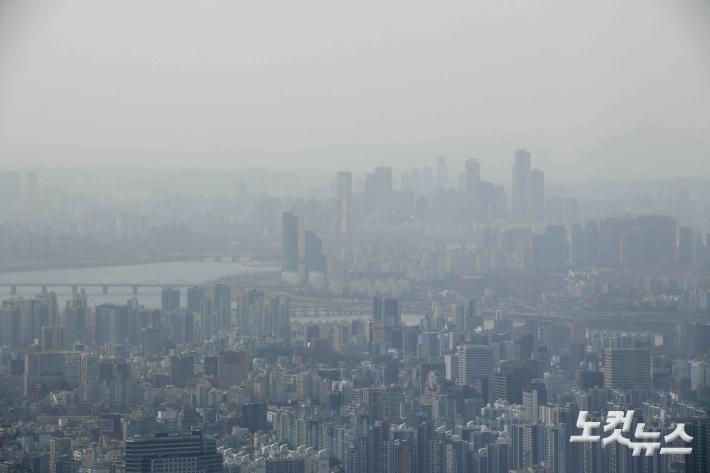<br />
      </td>
    </tr>
  </table>
</div>

🔗 관련 기사:
- [중국발 미세먼지 및 몽골발 황사 영향](https://www.chosun.com/national/transport-environment/2025/03/12/NISU7VVNRRGXZFIE27QK4C6MK4/)
- [중국발 스모그에 의한 초미세먼지 기승](https://news.jtbc.co.kr/article/NB12239427?influxDiv=NAVER)

- **데이터 프레임 정보**

| 등급       | PM10 (μg/m³) | PM2.5 (μg/m³) |
|------------|--------------|---------------|
| 좋음       | 0~30         | 0~15          |
| 보통       | 31~80        | 16~35         |
| 나쁨       | 81~150       | 36~75         |
| 매우 나쁨  | 151 이상     | 76 이상       |

---
# 🐕 분석에 사용한 데이터셋
> **Google Earth Engine**
- **데이터 내용:** : 도시별 미세먼지 및 초 미세먼지 농도

---
# 🐕 기술 스택
<table width="100%">
  <tr>
    <td align="center" valign="middle" width="25%">
      <br />
    </td>
    <td align="center" valign="middle" width="25%">
      <br />
    </td>
    <td align="center" valign="middle" width="25%">
      <br />
    </td>
    <td align="center" valign="middle" width="25%">
      
    </td>
  </tr>
</table>

---
# 🐕 DataSet을 통해 얻고자 하는 인사이트
1. 중국의 미세먼지에 따라 주변국에 미치는 영향을 알 수 있다.
2. 미세먼지 농도를 예측 할 수 있다.
3. **중국의 미세먼지 농도에 따른 주변국의 미세먼지 예측**할 수 있다.

---
# 🐕 데이터셋 데이터 구조
| 열 번호 | 열 이름          | 설명   | 데이터 타입 |
|---------|------------------|---------------|-------------|
| 0       | Date            | 날짜        | object      |
| 1       | City            | 도시        | object      |
| 2       | Longitude       | 경도        | float64     |
| 3       | Latitude        | 위도        | float64     |
| 4       | PM2.5 (µg/m³)   | 초미세먼지 농도        | float64     |
| 5       | PM10 (µg/m³)    | 미세먼지 농도        | float64     |

---
# 🐕 EDA 절차
##  **데이터 로드** 
```python
df = pd.read_csv('./data/pm25_pm10_merged.csv')
```

---
# 🐕 데이터 시각화
- 도시별 미세먼지 상관관계 히트맵
<div align="center">
  <table>
    <tr>
      <td align="center" valign="middle">
        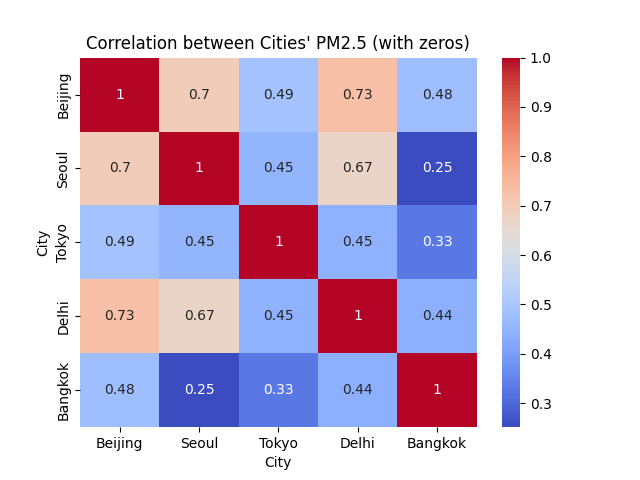<br />
      </td>
    </tr>
  </table>
</div>

- 연도별 도시의 평균 초미세먼지 농도
<div align="center">
  <table>
    <tr>
      <td align="center" valign="middle">
        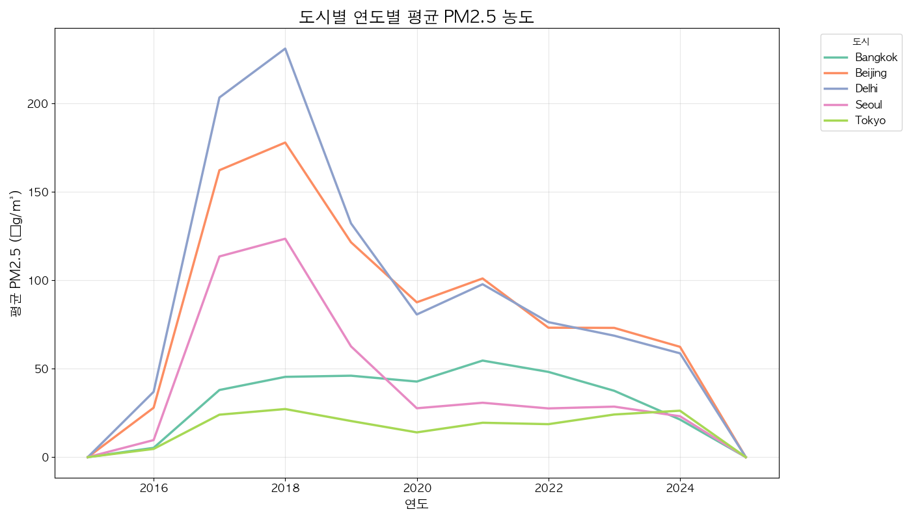<br />
      </td>
    </tr>
  </table>
</div>

---
# 🐕 데이터 학습 
## Gradient Boosting + Label Encode
- **Gradient Boosting**
   - 회귀 및 분류 문제에서 높은 예측 정확도를 제공
   - PM2.5 농도 예측과 같은 비선형적이고 복잡한 데이터 패턴을 효과적으로 학습 가능

   - 지도 학습 방식으로 데이터 분류
   - Label Encoding을 통해 범주형 데이터를 숫자로 변환한 후 Gradient Boosting에 입력하여 정확한 분류가 가능하도록 설계

## DBSCAN + XGBoost
- **XGBoost (XGBRegressor)목적**
    - 도시별 미세먼지(PM2.5 및 PM10) 농도를 예측
    - 각 클러스터와 도시별로 독립적으로 학습
    - 훈련 데이터와 테스트 데이터를 분리하여 모델 성능 평가

    **DBSCAN 목적**
    - 데이터 군집화(클러스터링) 수행
    - 베이징 미세먼지 농도와 월 데이터를 기반으로 클러스터를 생성
    - 노이즈(-1로 표시된 클러스터)는 제외
    - 
## DBSCAN + Linear_regression
- 데이터 전처리 및 병합
    - 2018년 이후 PM 데이터와 풍속/풍향 정보를 이용해 Wind_X, Wind_Y 등의 새로운 특성을 생성하고, 중국 및 주변국 데이터를 집계·병합

- DBSCAN 군집화
    - DBSCAN(eps=0.5, min_samples=5)을 통해 PM2.5 데이터를 군집화하여 PM2.5_Cluster 레이블 생성


- 선형 회귀 모델 학습 및 평가
    - 생성된 특성으로 선형 회귀 모델을 학습, 평가, 예측하고 결과 시각화

## K-means + Ensemble
- **Kmeans의 목적**
    - 미세먼지의 좋음 나쁨 매우 나쁨을 기준으로 군집화
      
- **Ensemble**
    - gradientBoosting과 randomforest의 학습 결과를 stacking을 통해 성능을 높이기 위해 사용
      
- **RandomizedSearchCV**
    - 최적의 하이퍼파라미터를 찾기 위해 사용   

---
## 학습 점수
### Gradient Boosting + Label Encode
<div align="center">
  <table width="100%" cellspacing="0" cellpadding="0">
    <tr><td align="center">
      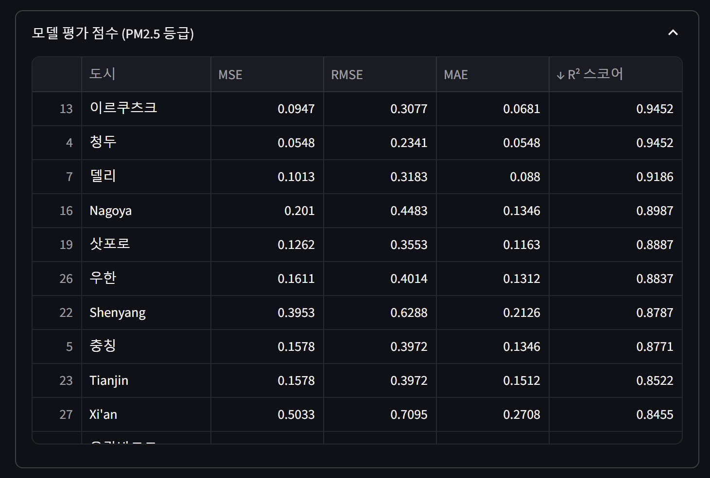<br />
      <small>Gradient Boosting + Lable Encode 모델평가점수</small>
    </td></tr>
    <tr><td align="center">
      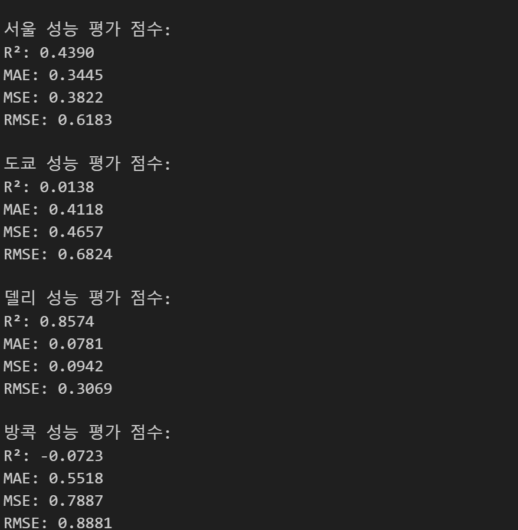<br />
      <small>Gradient Boosting + Label Encode 성능평가점수</small>
    </td></tr>
  </table>
</div>

---
### DBSCAN + XGBoost
<div align="center">
  <table width="100%" cellspacing="0" cellpadding="0">
    <tr><td align="center">
      <br />
      <small>DBSCAN + XGBoost 모델평가점수</small>
    </td></tr>
    <tr><td align="center">
      <br />
      <small>DBSCAN + XGBoost 성능평가점수</small>
    </td></tr>
    <tr><td align="center">
      <br />
      <small>DBSCAN + XGBoost 성능평가점수</small>
    </td></tr>
  </table>
</div>

---
### DBSCAN + Linear_regression
<div align="center">
  <table width="100%" cellspacing="0" cellpadding="0">
    <tr><td align="center">
      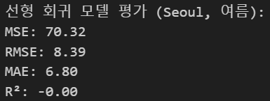<br />
      <small>DBSCAN + Linear_regression 모델평가점수</small>
    </td></tr>
    <tr><td align="center">
      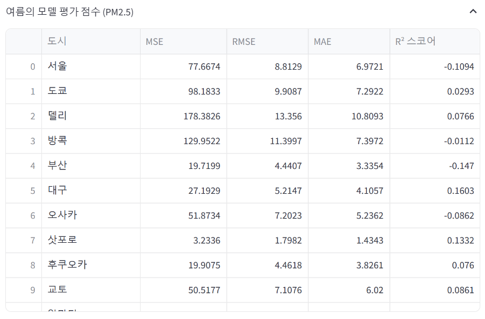<br />
      <small>DBSCAN + XGBoost 모델평가점수(PM 2.5)</small>
    </td></tr>
    <tr><td align="center">
      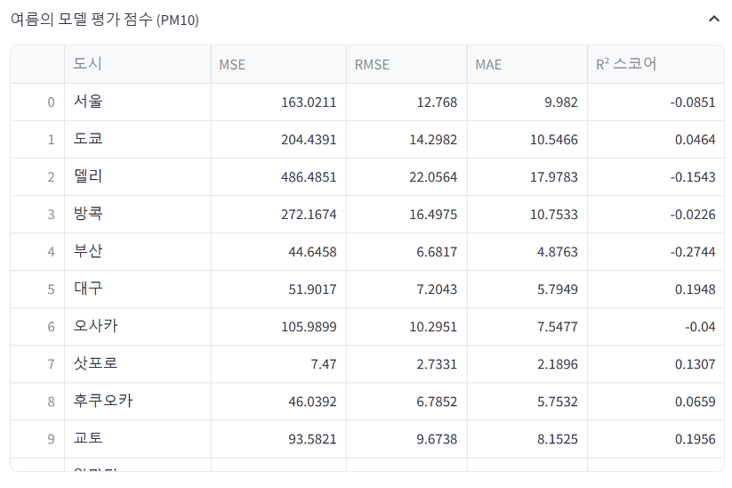<br />
      <small>DBSCAN + XGBoost 모델평가점수(PM 10)</small>
    </td></tr>
  </table>
</div>

---
### K-means + Ensemble
<div align="center">
  <table>
    <tr>
      <td align="center" valign="middle">
        <br />
        <small>K-means + Ensemble 모델평가점수(PM 10)</small>
      </td>
    </tr>
  </table>
</div>

---
## 예측
### Gradient Boosting + Label Encode
<div align="center">
  <table>
    <tr>
      <td align="center" valign="middle">
        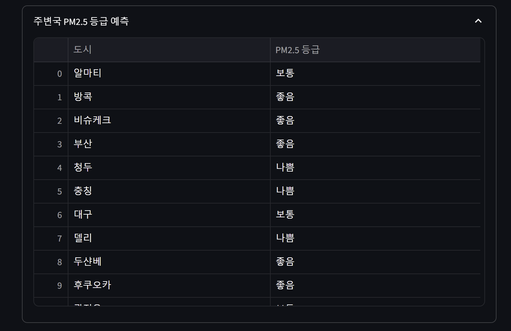<br />
        <small>Gradient Boosting + Label Encode 예측 지표</small>
      </td>
    </tr>
  </table>
</div>

---
### DBSCAN + XGBoost
<div align="center">
  <table>
    <tr>
      <td align="center" valign="middle">
        <br />
        <small>DBSCAN + XGBoost 예측 지표</small>
      </td>
    </tr>
  </table>
</div>

---
### DBSCAN + Linear_regression
- PM2.5
<div align="center">
  <table width="100%" cellspacing="0" cellpadding="0">
    <tr><td align="center">
      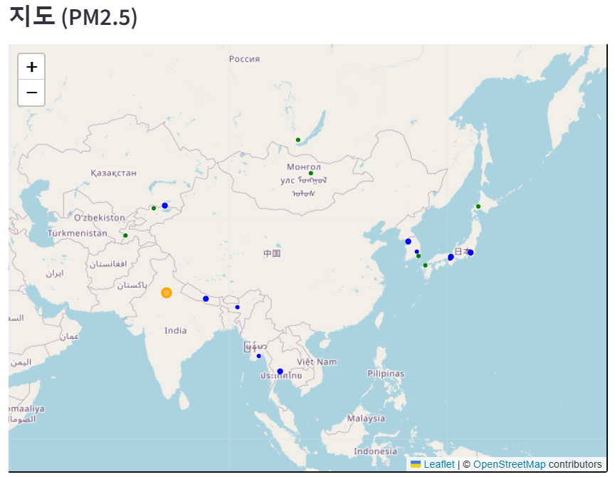<br />
      <small>DBSCAN + Linear_regression 예측 지도(PM 2.5)</small>
    </td></tr>
    <tr><td align="center">
      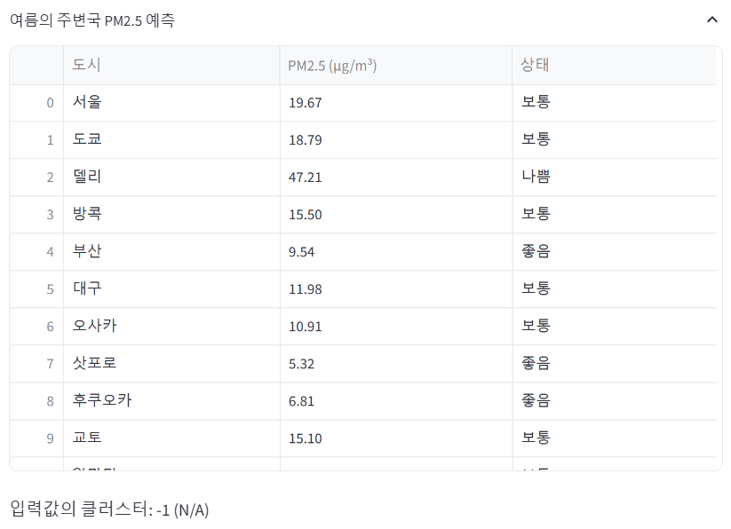<br />
      <small>DBSCAN + Linear_regression 예측 지표(PM 2.5)</small>
    </td></tr>
  </table>
</div>

- PM10
<div align="center">
  <table width="100%" cellspacing="0" cellpadding="0">
    <tr><td align="center">
      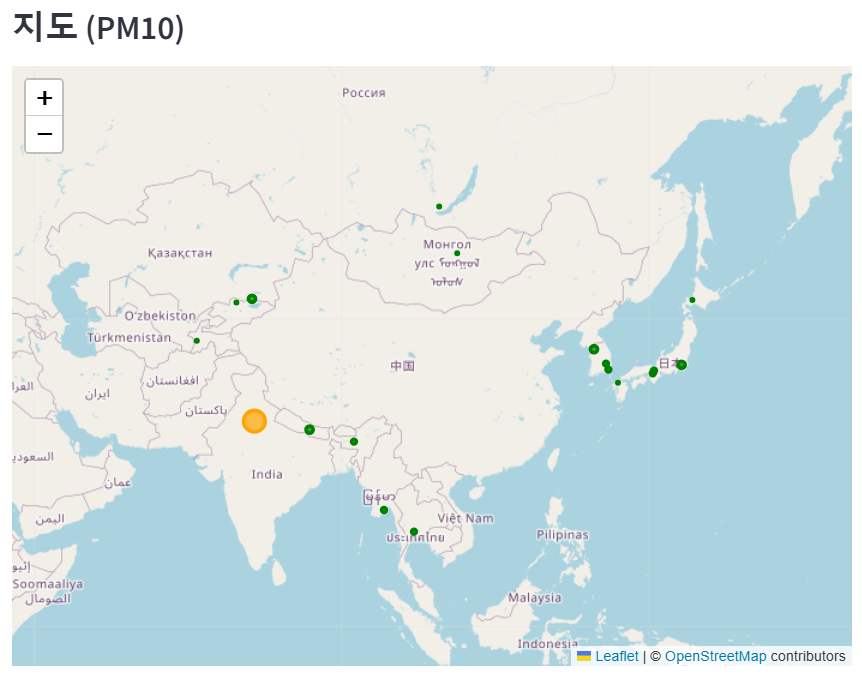<br />
      <small>DBSCAN + Linear_regression 예측 지도(PM 10)</small>
    </td></tr>
    <tr><td align="center">
      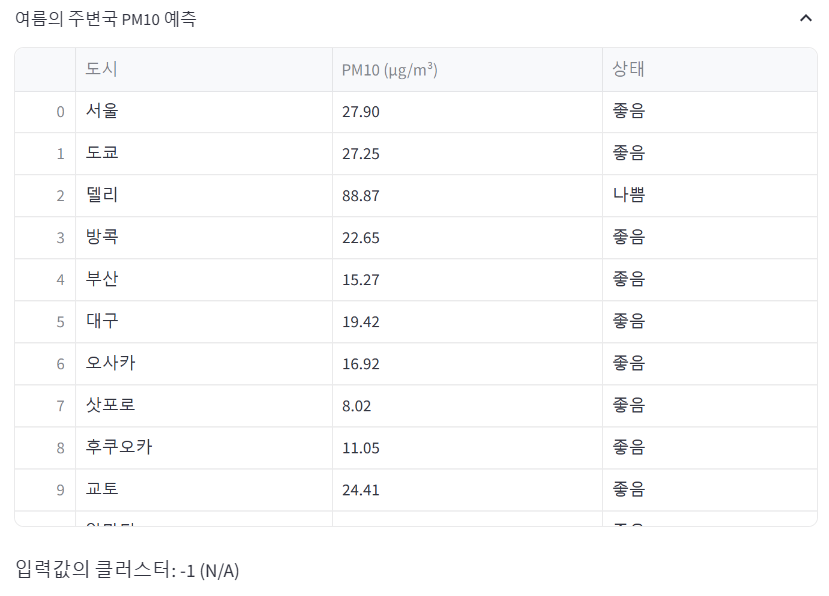<br />
      <small>DBSCAN + Linear_regression 예측 지표(PM 10)</small>
    </td></tr>
  </table>
</div>

---
### K-means + Ensemble 
<div align="center">
  <table>
    <tr>
      <td align="center" valign="middle">
        <br />
        <small>K-means + Ensemble 예측 지표</small>
      </td>
    </tr>
  </table>
</div>
